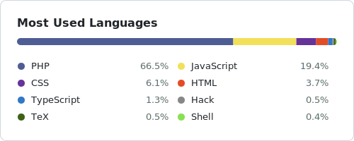

# GitHub Language Stats Generator

自分のGitHubアカウントの全リポジトリ（プライベート含む）から言語使用率を集計し，README.md用のSVGカードを生成するスクリプト．サーバー不要．GitHub Actionsで完結する．

## セットアップ

### 1. プロフィールリポジトリに配置

このプロジェクトのファイル一式を `k-kushihama/k-kushihama` リポジトリ（プロフィールREADMEリポジトリ）に配置する．

### 2. Personal Access Tokenを発行

[github.com/settings/tokens/new](https://github.com/settings/tokens/new) でclassic tokenを作成する．

- スコープ：`repo`（プライベートリポジトリの言語データ取得に必須）
- 有効期限：長めに設定する．期限切れでカード更新が止まる

### 3. Secretsに登録

リポジトリの `Settings > Secrets and variables > Actions` で新しいsecretを作成．

- Name: `STATS_PAT`
- Value: 手順2で取得したトークン

### 4. ワークフロー初回実行

`Actions` タブから `Update Language Stats` を選び，`Run workflow` で手動実行．成功すると `generated/` ディレクトリに2つのSVGが生成・コミットされる．

### 5. README.mdに埋め込み

`k-kushihama/k-kushihama` の `README.md` に以下を追加．`prefers-color-scheme` でダーク／ライト自動切替される．

```markdown
<picture>
  <source media="(prefers-color-scheme: dark)" srcset="./generated/top-langs-dark.svg">
  
</picture>
```

## カスタマイズ

`.github/workflows/update-stats.yml` の `env` セクションで変更可能．

| 変数 | デフォルト | 説明 |
|------|-----------|------|
| `TOP_N` | `8` | 表示する言語数 |
| `CARD_WIDTH` | `500` | カード幅（px） |
| `CARD_TITLE` | `Most Used Languages` | カードのタイトル |
| `EXCLUDE_LANGS` | (空) | 除外する言語．カンマ区切り（例: `HTML,CSS`） |

## ローカル動作確認

```bash
npm install
GH_TOKEN=ghp_xxxxx npm run generate
```

`./generated/top-langs-light.svg` と `./generated/top-langs-dark.svg` が生成される．

## 仕組み

- GitHub GraphQL APIで `viewer.repositories(ownerAffiliations: OWNER, isFork: false)` を全ページ取得
- 各リポジトリの言語バイト数を集計してパーセンテージを計算
- 上位N言語を積み上げバー＋凡例で表示するSVGをlight/dark両テーマで生成
- GitHub Actionsで毎日00:00 UTCに自動実行・自動コミット
- コミットメッセージに `[skip ci]` を含めることで無限ループを防止

## 既知の制約

- **organization配下のリポジトリは含まれない**．個人アカウント `k-kushihama` 名義のもののみ
- **GitHub Linguistの判定に従う**．バイト数ベースなので，vendor配下や生成ファイル，巨大なJSONなどが入っていると実態と乖離する
- 対策：各リポジトリ直下に `.gitattributes` を置く

```gitattributes
node_modules/* linguist-vendored
vendor/* linguist-vendored
dist/* linguist-generated=true
*.min.js linguist-vendored
*.min.css linguist-vendored
```

## セキュリティ

- PATは `repo` スコープが必要．実質フルアクセス権なので絶対にコミットしない
- Vercel等の外部サーバーには渡さない．GitHub Secrets内のみで完結する設計
- PAT漏洩時は即 [revoke](https://github.com/settings/tokens) する
